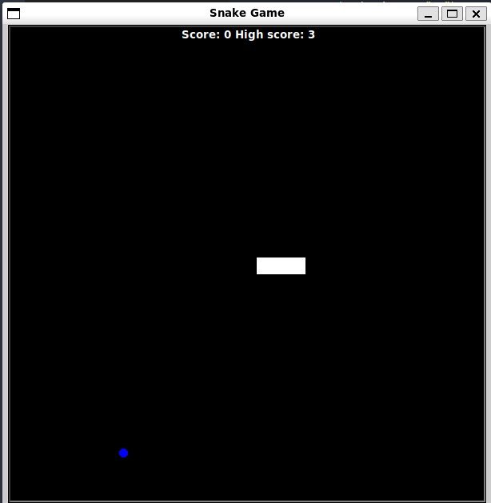

# Snake game

This is a replica of the snake game that were avaliable in old Nokia cellphones.



This challenge teaches the concepts of:
 - Object oriented programing
 - Class Inheritance
 - Class Constructors

## Setup

This game uses the Python Turtle module.

## How to run

```
python main.py
```