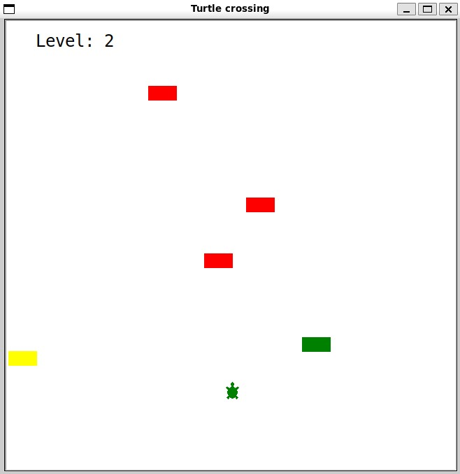

# Turtle crossing

This is a simpler version of the frogger game that were avaliable in old Atari consoles.



This challenge teaches the concepts of:
 - Object oriented programing
 - Class Inheritance
 - Class Constructors

 ## Setup

This game uses the Python Turtle module.

## How to run

```
python main.py
```