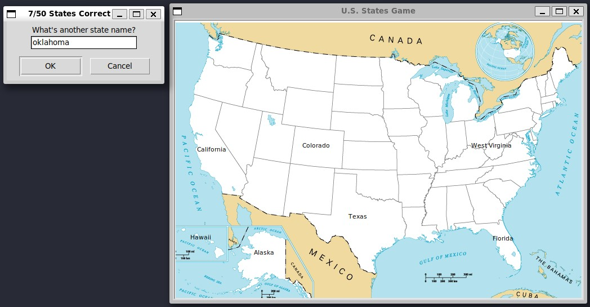

# US States game

This is a simple game on guessing US states names.



This challenge teaches the concepts of:
 - Reading csv
 - Initial Pandas concept (Dataframe, Series)
 - Images as shapes in turtle

## Setup

This game uses the Python Turtle module and pandas.

```
pip install pandas
```

## How to run

```
python main.py
```
