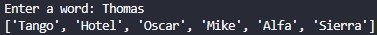

# NATO Alphabet

This is a simple program that translate a word into NATO alphabet letters.



This challenge teaches the concepts of:
 - List comprehension
 - Dictionary comprehension

## Setup

This program uses pandas.

```
pip install pandas
```

## How to run

```
python main.py
```
