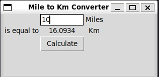

# Mile to Km converter

This is a simple tool that convert miles to kilometers.



This challenge teaches the concepts of:
 - *args and **kwargs
 - Tkinter GUI

## Setup

This program uses the Python Tkinter module.

## How to run

```
python main.py
```