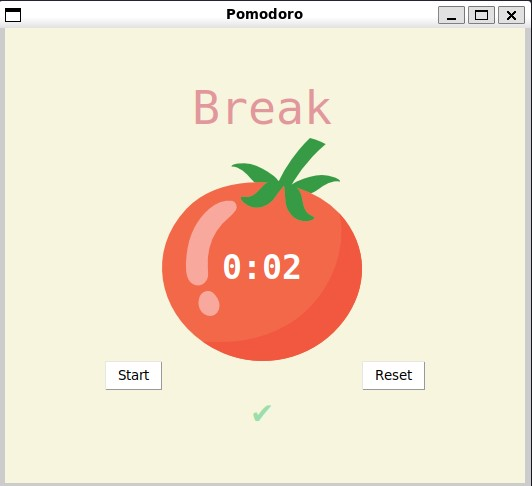

# Pomodoro

This is a simple timer tool based on the pomodoro tecnique.



This challenge teaches the concepts of:

 - Tkinter widgets

## Setup

This program uses the Python Tkinter module.

## How to run

```
python main.py
```