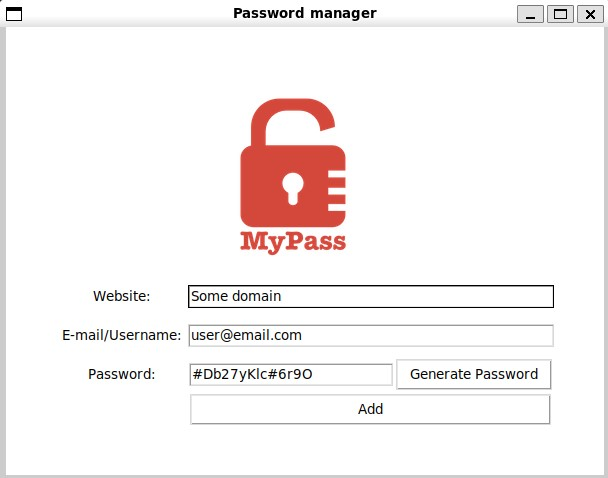

# Password manager

This is a simple password tool that generate and stores your password in a file.



This challenge teaches the concepts of:

 - Tkinter widgets
 - Widgets insert, delete, focus
 - Grid Colspan
 - Tkinter Dialog boxes and Popups

## Setup

This program uses the Python Tkinter module.

## How to run

```
python main.py
```